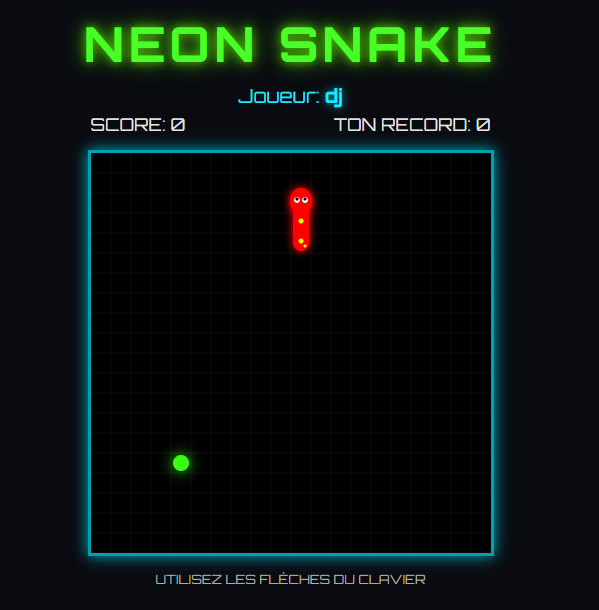

# 🐍 Neon Snake

Un jeu de Snake rétro avec une esthétique **cyberpunk néon**, jouable directement dans le navigateur.

  

## 🎮 Jouer maintenant

👉 **[Cliquez ici pour jouer !](https://raphdespeed.github.io/snake/)**

## ✨ Fonctionnalités

- 🎨 **Style néon** — Effets de glow, couleurs vibrantes et police Orbitron
- 👤 **Système de pseudo** — Entre ton nom et retrouve tes meilleurs scores
- 🏆 **Leaderboard local** — Classement des 50 meilleurs scores sauvegardé dans le navigateur
- 🍎 **Grosse pomme bonus** — Apparaît toutes les 3 pommes, avec un compte à rebours de 5 secondes et des points dégressifs
- 📈 **Difficulté progressive** — La vitesse augmente après 10 points
- 📱 **Compatible mobile** — Contrôles tactiles pour jouer sur téléphone

## 🕹️ Contrôles

| Plateforme | Contrôles |
|---|---|
| 🖥️ PC | Flèches du clavier |
| 📱 Mobile | Boutons tactiles à l'écran |
